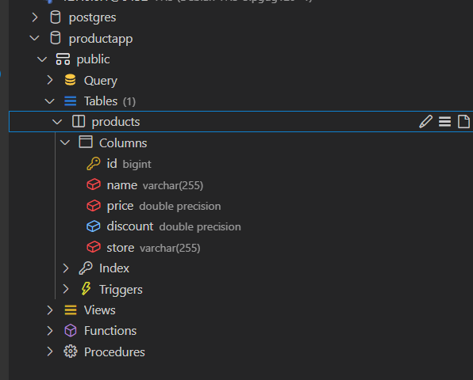

Echo framework and labstack

// go get github.com/labstack/echo/{version}

```bash
go get github.com/labstack/echo/v4
```

```
go get github.com/jackc/pgx/v5
```

```
go get github.com/labstack/gommon
```

2. Posgress Sql instalation



## 1. web server

```
e := echo.New()
e.Start("localhost:8080")
```

## Domain Server Folder

```
type Product struct {  
Id       int64  
Name     string  
Price    float32  
Discount float32  
Store    string
}
```

## Persistence

product_repository.go

1. GetAllProducts()

## Infrastructure

product_repository_test.go 

m *testing.M for test function

m.Run("TestAdd",func(t *testing.T)
